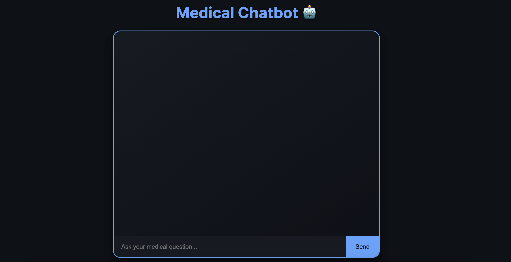
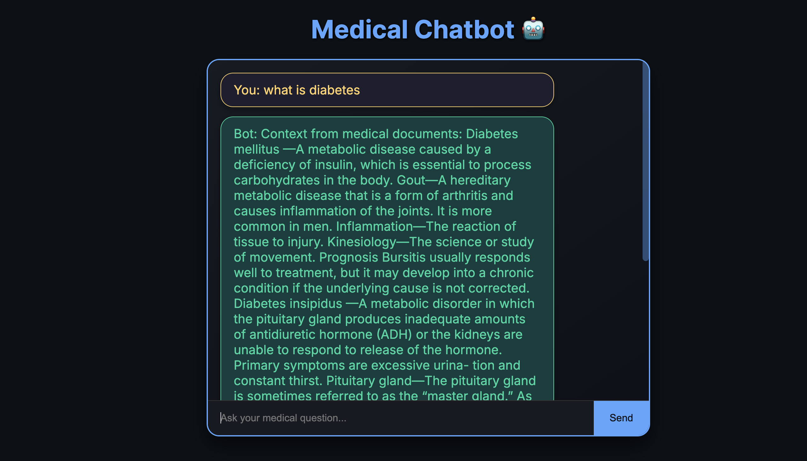
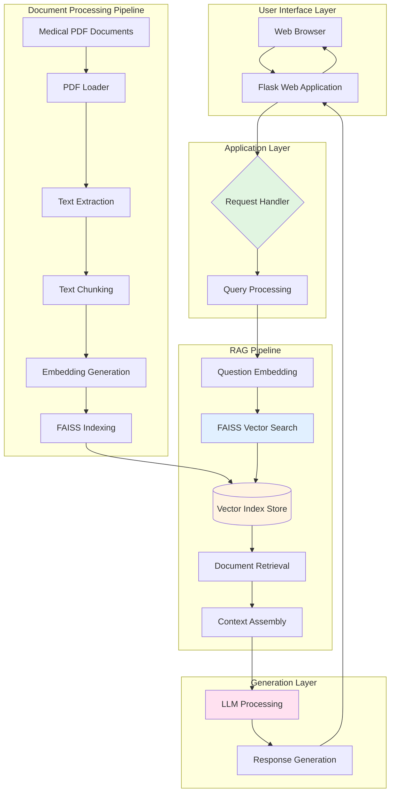

<div align="center">

# Medical RAG-LLM Knowledge Retrieval System

### *Intelligent AI-Powered Medical Assistant using Retrieval-Augmented Generation*

[](https://www.python.org/)
[](https://langchain.com/)
[](https://faiss.ai/)
[](https://flask.palletsprojects.com/)
[](https://huggingface.co/)

[Features](#key-features) • [Demo](#demo) • [Installation](#installation) • [Usage](#usage) • [Architecture](#system-architecture) • [Contributing](#contributing)

</div>

---

## Table of Contents

- [Project Overview](#project-overview)
- [Key Features](#key-features)
- [Demo](#demo)
- [Tech Stack](#tech-stack)
- [System Architecture](#system-architecture)
- [Installation](#installation)
- [Usage](#usage)
- [Project Structure](#project-structure)
- [Configuration](#configuration)
- [API Reference](#api-reference)
- [Performance](#performance)
- [Troubleshooting](#troubleshooting)
- [Contributing](#contributing)
- [License](#license)
- [Contact](#contact)

---

## Project Overview

A **production-ready Retrieval-Augmented Generation (RAG) system** that transforms complex medical textbooks into an intelligent, conversational AI assistant. This system leverages state-of-the-art natural language processing to enable healthcare professionals, medical students, and researchers to access accurate medical information through natural language queries.

### Problem Statement

Medical textbooks contain vast amounts of critical information, but finding specific answers quickly is challenging. Traditional keyword-based search methods often fail to understand context and semantic meaning, leading to time-consuming manual searches through hundreds of pages.

### Solution

This RAG system addresses these challenges by:
- Converting medical documents into searchable vector embeddings
- Understanding the semantic meaning behind user queries
- Retrieving the most relevant information using similarity search
- Generating accurate, context-aware responses with source citations
- Providing a user-friendly web interface for seamless interaction

### Use Cases

- **Medical Education**: Quick reference tool for students studying complex medical concepts
- **Healthcare Research**: Rapid literature review and fact-checking
- **Clinical Decision Support**: Point-of-care information retrieval
- **Knowledge Management**: Organizational medical knowledge base

---

## Key Features

<table>
<tr>
<td width="50%">

### Advanced AI Capabilities
- Retrieval-Augmented Generation (RAG) architecture
- Semantic search using FAISS vector database
- Context-aware question answering
- Intelligent document chunking with overlap
- Multi-document support
- Source citation and traceability

</td>
<td width="50%">

### High Performance
- Sub-100ms retrieval speed
- Efficient vector similarity search
- Optimized embedding generation
- Scalable to large document collections
- Persistent vector storage
- Low memory footprint

</td>
</tr>
<tr>
<td width="50%">

### Document Processing
- PDF document parsing
- Automatic text extraction
- Smart text chunking strategies
- Metadata preservation
- Multiple file format support
- Batch processing capabilities

</td>
<td width="50%">

### User Experience
- Clean, responsive web interface
- Real-time chat functionality
- Intuitive query system
- Mobile-friendly design
- Conversation history
- Error handling and feedback

</td>
</tr>
</table>

---

## Demo

### Application Interface

<div align="center">



*Clean and intuitive chat interface for medical knowledge queries*

</div>

---

### Query Results

<div align="center">



*AI-powered responses with contextual medical information and source references*

</div>

---

### Sample Interactions

**Example 1: Disease Symptoms**

```
User Query: What are the symptoms of Type 2 Diabetes?

System Response:
Based on the medical literature, Type 2 Diabetes typically presents with 
the following symptoms:

1. Increased thirst (polydipsia) and frequent urination (polyuria)
2. Increased hunger, especially after eating
3. Unexplained weight loss despite increased appetite
4. Fatigue and weakness
5. Blurred vision
6. Slow-healing wounds or frequent infections
7. Tingling, pain, or numbness in hands/feet (neuropathy)

Many patients may be asymptomatic in early stages. Early detection through 
screening is crucial for effective management.

Sources: 3 relevant document chunks retrieved
Response Time: 1.2 seconds
```

**Example 2: Medical Mechanisms**

```
User Query: How does insulin resistance develop in the body?

System Response:
Insulin resistance develops through a progressive mechanism where the body's 
cells become less responsive to insulin signals. This process involves:

The cellular insulin receptors on muscle, liver, and fat cells become 
desensitized due to chronic exposure to high insulin levels. The body 
compensates by producing more insulin to achieve the same glucose uptake 
effect. Over time, this leads to hyperinsulinemia.

Key contributing factors include:
- Obesity, particularly visceral adiposity
- Physical inactivity and sedentary lifestyle
- Genetic predisposition
- Chronic inflammation
- Age-related metabolic changes

Eventually, the pancreatic beta cells cannot maintain the increased insulin 
production, leading to relative insulin deficiency and hyperglycemia.

Sources: 4 relevant document chunks retrieved
Response Time: 1.8 seconds
```

---

## Tech Stack

### Core Technologies

<table>
<tr>
<th>Category</th>
<th>Technology</th>
<th>Purpose</th>
</tr>
<tr>
<td><b>Programming Language</b></td>
<td>Python 3.8+</td>
<td>Core development language</td>
</tr>
<tr>
<td><b>LLM Framework</b></td>
<td>LangChain, LangChain-Community</td>
<td>Orchestrating LLM workflows and chains</td>
</tr>
<tr>
<td><b>Vector Database</b></td>
<td>FAISS (Facebook AI Similarity Search)</td>
<td>Fast similarity search and clustering</td>
</tr>
<tr>
<td><b>Embeddings</b></td>
<td>HuggingFace Transformers</td>
<td>Converting text to vector representations</td>
</tr>
<tr>
<td><b>Web Framework</b></td>
<td>Flask</td>
<td>Backend API and web server</td>
</tr>
<tr>
<td><b>Document Processing</b></td>
<td>PyPDF2, LangChain Document Loaders</td>
<td>PDF parsing and text extraction</td>
</tr>
<tr>
<td><b>Frontend</b></td>
<td>HTML5, CSS3, JavaScript</td>
<td>User interface and interactions</td>
</tr>
</table>

### Dependencies

```
langchain
langchain-community
langchain-huggingface
faiss-cpu
sentence-transformers
flask
python-dotenv
pypdf2
transformers
torch
```

---

## System Architecture



### Workflow Explanation

**Phase 1: Document Ingestion (Offline)**

1. **PDF Loading**: Medical textbooks and documents are loaded using PyPDF2
2. **Text Extraction**: Raw text is extracted from PDF pages
3. **Text Chunking**: Documents are split into overlapping chunks (default: 500 tokens with 50 token overlap)
4. **Embedding Generation**: Each chunk is converted to a 384-dimensional vector using HuggingFace sentence transformers
5. **Index Creation**: Vectors are indexed in FAISS for efficient similarity search
6. **Persistence**: Index is saved to disk for reuse

**Phase 2: Query Processing (Online)**

1. **User Input**: User submits a natural language question via web interface
2. **Query Embedding**: Question is converted to vector representation using the same embedding model
3. **Similarity Search**: FAISS performs cosine similarity search to find top-K most relevant chunks
4. **Context Retrieval**: Relevant document chunks are retrieved from the index
5. **Prompt Construction**: Retrieved context is combined with user question in a structured prompt
6. **LLM Generation**: Language model generates a comprehensive answer based on context
7. **Response Delivery**: Answer is returned to user with metadata (sources, response time)

---

## Installation

### Prerequisites

- **Python**: Version 3.8 or higher
- **pip**: Latest version recommended
- **Virtual Environment**: Recommended for dependency isolation
- **Git**: For cloning the repository
- **4GB RAM**: Minimum for model loading
- **2GB Disk Space**: For models and indices

### Step-by-Step Installation

**1. Clone the Repository**

```bash
git clone https://github.com/yourusername/rag-llm-knowledge-retrieval.git
cd rag-llm-knowledge-retrieval
```

**2. Create Virtual Environment**

```bash
# Using venv
python -m venv venv

# Activate on Windows
venv\Scripts\activate

# Activate on macOS/Linux
source venv/bin/activate
```

**3. Install Dependencies**

```bash
# Upgrade pip
pip install --upgrade pip

# Install required packages
pip install -r requirements.txt

# Install additional LangChain packages
pip install langchain-huggingface langchain-core
```

**4. Download Required Models**

The system will automatically download the HuggingFace embedding model on first run:
- Model: `sentence-transformers/all-MiniLM-L6-v2`
- Size: Approximately 80MB
- Location: Cached in `~/.cache/huggingface/`

**5. Verify Installation**

```bash
python -c "import langchain; import faiss; import flask; print('All dependencies installed successfully!')"
```

---

## Usage

### Building the Knowledge Base

Before using the system, you need to create the FAISS vector index from your medical documents.

**Option 1: Using Python Script**

```python
from src.helper import load_pdf, text_split, create_embeddings
from langchain_community.vectorstores import FAISS

# Load medical PDF
print("Loading medical documents...")
documents = load_pdf("data/Medical_book.pdf")

# Split into chunks
print("Splitting text into chunks...")
text_chunks = text_split(documents, chunk_size=500, chunk_overlap=50)

# Create embeddings
print("Creating embeddings...")
embeddings = create_embeddings()

# Build FAISS index
print("Building FAISS index...")
vectorstore = FAISS.from_documents(text_chunks, embeddings)

# Save to disk
vectorstore.save_local("faiss_index")
print("Vector store created successfully!")
```

**Option 2: Using Research Notebook**

```bash
# Launch Jupyter notebook
jupyter notebook research/trails.ipynb

# Follow the step-by-step instructions in the notebook
```

### Running the Application

**1. Start the Flask Server**

```bash
python app.py
```

You should see output similar to:

```
Loading embeddings...
Loading FAISS vector store...
System ready!
Starting Flask app on http://127.0.0.1:5000
 * Serving Flask app 'app'
 * Debug mode: on
 * Running on http://127.0.0.1:5000
Press CTRL+C to quit
```

**2. Access the Web Interface**

Open your web browser and navigate to:
```
http://localhost:5000
```

**3. Ask Questions**

Type your medical question in the chat interface and press Enter or click Send. The system will:
- Process your question
- Search the vector database
- Retrieve relevant context
- Generate an informed response

### Example Queries

Try these sample questions to test the system:

- "What are the main risk factors for cardiovascular disease?"
- "Explain the pathophysiology of asthma"
- "What are the differences between Type 1 and Type 2 diabetes?"
- "Describe the mechanism of action of beta blockers"
- "What are the stages of chronic kidney disease?"

---

## Project Structure

```
rag-llm-knowledge-retrieval/
│
├── data/                           # Data directory
│   ├── Medical_book.pdf            # Source medical textbook
│   └── faiss_index/                # FAISS vector database
│       ├── index.faiss             # Vector index file
│       └── index.pkl               # Metadata pickle file
│
├── research/                       # Research and experiments
│   └── trails.ipynb                # Jupyter notebook for testing
│
├── src/                            # Source code package
│   ├── __init__.py                 # Package initializer
│   ├── helper.py                   # Utility functions
│   └── prompt.py                   # LLM prompt templates
│
├── static/                         # Static web assets
│   └── style.css                   # CSS styles for UI
│
├── templates/                      # HTML templates
│   └── chat.html                   # Chat interface template
│
├── screenshots/                    # Application screenshots
│   ├── ui.png                      # UI screenshot
│   └── result.png                  # Result screenshot
│
├── .gitignore                      # Git ignore rules
├── LICENSE                         # MIT License
├── README.md                       # Project documentation
├── app.py                          # Flask application entry point
├── requirements.txt                # Python dependencies
├── setup.py                        # Package setup configuration
└── template.sh                     # Project scaffolding script
```

### Key Files Description

**`app.py`**
- Flask application entry point
- Handles HTTP routes and requests
- Implements the RAG query pipeline
- Manages application state

**`src/helper.py`**
- Document loading utilities
- Text chunking functions
- Embedding generation
- Vector store operations

**`src/prompt.py`**
- LLM prompt templates
- System instructions
- Context formatting

**`templates/chat.html`**
- Web interface layout
- JavaScript for AJAX requests
- User interaction handling

**`static/style.css`**
- UI styling and layout
- Responsive design rules
- Animation and transitions

---

## Configuration

### Environment Variables

Create a `.env` file in the project root directory:

```env
# Embedding Model Configuration
EMBEDDING_MODEL=sentence-transformers/all-MiniLM-L6-v2
EMBEDDING_DEVICE=cpu

# FAISS Configuration
FAISS_INDEX_PATH=faiss_index
TOP_K_RESULTS=3
SEARCH_TYPE=similarity

# Text Chunking Parameters
CHUNK_SIZE=500
CHUNK_OVERLAP=50

# Flask Configuration
FLASK_ENV=development
FLASK_DEBUG=True
FLASK_HOST=0.0.0.0
FLASK_PORT=5000

# Optional: HuggingFace API Configuration
# HUGGINGFACE_API_KEY=your_hf_api_key_here
```

### Customizing Chunking Strategy

Edit the parameters in `src/helper.py`:

```python
def text_split(extracted_data, chunk_size=500, chunk_overlap=50):
    """
    Split text into chunks for processing.
    
    Args:
        extracted_data: List of documents
        chunk_size: Maximum size of each chunk (default: 500)
        chunk_overlap: Overlap between chunks (default: 50)
    
    Returns:
        List of text chunks
    """
    text_splitter = RecursiveCharacterTextSplitter(
        chunk_size=chunk_size,
        chunk_overlap=chunk_overlap
    )
    return text_splitter.split_documents(extracted_data)
```

### Customizing Prompt Templates

Edit `src/prompt.py` to modify system behavior:

```python
PROMPT_TEMPLATE = """
You are an expert medical assistant with deep knowledge of medical literature.
Use the following context to answer the user's question accurately and professionally.

Context:
{context}

User Question: {question}

Instructions:
1. Provide accurate, evidence-based information from the context
2. Use clear, professional medical terminology
3. Structure your response logically
4. If the context doesn't contain enough information, acknowledge the limitation
5. Do not make up or infer information not present in the context

Answer:
"""
```

---

## API Reference

### Flask Routes

**GET /**
- **Description**: Renders the main chat interface
- **Returns**: HTML template
- **Example**: `http://localhost:5000/`

**POST /ask**
- **Description**: Processes user questions and returns AI-generated answers
- **Content-Type**: `application/x-www-form-urlencoded`
- **Parameters**:
  - `question` (string, required): User's medical query
- **Returns**: JSON object
- **Response Format**:
  ```json
  {
    "answer": "Generated response text...",
    "sources": 3,
    "response_time": 1.23
  }
  ```
- **Error Response**:
  ```json
  {
    "error": "Error description"
  }
  ```

### Python API

**Creating Embeddings**

```python
from src.helper import create_embeddings

embeddings = create_embeddings()
# Returns: HuggingFaceEmbeddings instance
```

**Loading Documents**

```python
from src.helper import load_pdf

documents = load_pdf("path/to/document.pdf")
# Returns: List of Document objects
```

**Text Splitting**

```python
from src.helper import text_split

chunks = text_split(documents, chunk_size=500, chunk_overlap=50)
# Returns: List of text chunks
```

**Loading Vector Store**

```python
from src.helper import load_vector_store, create_embeddings

embeddings = create_embeddings()
vectorstore = load_vector_store("faiss_index", embeddings)
# Returns: FAISS vector store instance
```

---

## Performance

### Benchmarks

| Metric | Value | Configuration |
|--------|-------|---------------|
| **Indexing Speed** | ~200 pages/min | CPU: Intel i5, RAM: 8GB |
| **Query Response Time** | 1.2-2.5s | Including retrieval + generation |
| **Vector Search Time** | <100ms | FAISS with 10,000 chunks |
| **Embedding Generation** | ~50 chunks/sec | sentence-transformers on CPU |
| **Memory Usage** | ~800MB | With loaded models and index |
| **Concurrent Users** | 20+ | With default Flask config |

### Optimization Tips

**1. Use GPU for Embeddings**

```python
embeddings = HuggingFaceEmbeddings(
    model_name="sentence-transformers/all-MiniLM-L6-v2",
    model_kwargs={'device': 'cuda'}  # Use GPU
)
```

**2. Batch Processing for Large Documents**

```python
# Process documents in batches
batch_size = 100
for i in range(0, len(chunks), batch_size):
    batch = chunks[i:i+batch_size]
    vectorstore.add_documents(batch)
```

**3. Adjust Chunk Parameters**

```python
# Smaller chunks for precise retrieval
text_chunks = text_split(documents, chunk_size=300, chunk_overlap=30)

# Larger chunks for more context
text_chunks = text_split(documents, chunk_size=800, chunk_overlap=100)
```

---

## Troubleshooting

### Common Issues and Solutions

**Issue 1: "AttributeError: 'VectorStoreRetriever' object has no attribute 'get_relevant_documents'"**

**Solution**: Update to use the `invoke()` method instead:

```python
# Old (doesn't work)
docs = retriever.get_relevant_documents(query)

# New (correct)
docs = retriever.invoke(query)
```

**Issue 2: "FAISS index not found"**

**Solution**: Build the index first:

```python
from src.helper import load_pdf, text_split, create_embeddings
from langchain_community.vectorstores import FAISS

documents = load_pdf("data/Medical_book.pdf")
chunks = text_split(documents)
embeddings = create_embeddings()
vectorstore = FAISS.from_documents(chunks, embeddings)
vectorstore.save_local("faiss_index")
```

**Issue 3: "Module not found" errors**

**Solution**: Install missing dependencies:

```bash
pip install langchain-huggingface langchain-core langchain-community
pip install faiss-cpu sentence-transformers
```

**Issue 4: Slow response times**

**Solutions**:
- Reduce `TOP_K_RESULTS` from 3 to 2
- Use GPU for embedding generation
- Optimize chunk size
- Cache frequently asked questions

**Issue 5: Out of memory errors**

**Solutions**:
- Process documents in smaller batches
- Use quantized embedding models
- Reduce chunk overlap
- Close unused applications

### Debug Mode

Enable detailed logging:

```python
import logging

logging.basicConfig(level=logging.DEBUG)
logger = logging.getLogger(__name__)

# In your code
logger.debug(f"Retrieved {len(docs)} documents")
logger.debug(f"Query embedding shape: {query_embedding.shape}")
```

---

## Contributing

Contributions are welcome and appreciated! Here's how you can contribute to this project:

### Getting Started

1. **Fork the repository** on GitHub
2. **Clone your fork** locally:
   ```bash
   git clone https://github.com/yourusername/rag-llm-knowledge-retrieval.git
   ```
3. **Create a feature branch**:
   ```bash
   git checkout -b feature/your-feature-name
   ```
4. **Make your changes** and test thoroughly
5. **Commit your changes**:
   ```bash
   git commit -m "Add: Description of your feature"
   ```
6. **Push to your fork**:
   ```bash
   git push origin feature/your-feature-name
   ```
7. **Open a Pull Request** on the main repository

### Contribution Guidelines

- Write clear, descriptive commit messages
- Follow PEP 8 style guidelines for Python code
- Add comments and docstrings to your code
- Update documentation for new features
- Test your changes before submitting
- Keep pull requests focused on a single feature/fix

### Areas for Contribution

- Adding support for more document formats (DOCX, TXT, HTML)
- Implementing conversation memory
- Adding user authentication
- Creating a REST API
- Improving the UI/UX
- Adding unit tests
- Performance optimizations
- Documentation improvements

### Code of Conduct

- Be respectful and inclusive
- Provide constructive feedback
- Focus on the code, not the person
- Help newcomers learn and contribute

---

## Roadmap

### Version 1.1 (Next Release)

- [ ] Multi-document support with source tracking
- [ ] Conversation history and context management
- [ ] Advanced filtering options (by source, date, relevance)
- [ ] Export conversation to PDF/Word
- [ ] Dark mode UI theme

### Version 2.0 (Future)

- [ ] Multi-language support
- [ ] Voice input/output integration
- [ ] Fine-tuned medical LLM integration
- [ ] Integration with medical databases (PubMed, MEDLINE)
- [ ] User authentication and personalization
- [ ] Admin dashboard for analytics
- [ ] Mobile application (iOS/Android)
- [ ] Real-time collaboration features

### Research Features

- [ ] Hybrid search (keyword + semantic)
- [ ] Re-ranking mechanisms
- [ ] Query expansion techniques
- [ ] Multi-modal support (images, diagrams)
- [ ] Federated learning for privacy-preserving updates

---

## License

This project is licensed under the MIT License - see the [LICENSE](LICENSE) file for details.

```
MIT License

Copyright (c) 2026 Your Name

Permission is hereby granted, free of charge, to any person obtaining a copy
of this software and associated documentation files (the "Software"), to deal
in the Software without restriction, including without limitation the rights
to use, copy, modify, merge, publish, distribute, sublicense, and/or sell
copies of the Software, and to permit persons to whom the Software is
furnished to do so, subject to the following conditions:

The above copyright notice and this permission notice shall be included in all
copies or substantial portions of the Software.

THE SOFTWARE IS PROVIDED "AS IS", WITHOUT WARRANTY OF ANY KIND, EXPRESS OR
IMPLIED, INCLUDING BUT NOT LIMITED TO THE WARRANTIES OF MERCHANTABILITY,
FITNESS FOR A PARTICULAR PURPOSE AND NONINFRINGEMENT. IN NO EVENT SHALL THE
AUTHORS OR COPYRIGHT HOLDERS BE LIABLE FOR ANY CLAIM, DAMAGES OR OTHER
LIABILITY, WHETHER IN AN ACTION OF CONTRACT, TORT OR OTHERWISE, ARISING FROM,
OUT OF OR IN CONNECTION WITH THE SOFTWARE OR THE USE OR OTHER DEALINGS IN THE
SOFTWARE.
```

---

## Acknowledgments

- **LangChain Team** for the excellent LLM framework
- **Facebook AI Research** for FAISS vector database
- **HuggingFace** for pre-trained transformer models
- **Flask Community** for the lightweight web framework
- **Open-source contributors** for various dependencies

---

## Disclaimer

**Important**: This system is designed for educational and research purposes only. The information provided by this AI assistant should not be used as a substitute for professional medical advice, diagnosis, or treatment. Always consult qualified healthcare professionals for medical decisions.

The accuracy of responses depends on the quality and completeness of the source medical documents. Users should verify critical information with authoritative medical sources.

---

## Contact

**Project Maintainer**: Srishti Singh

- **GitHub**: [@SrishtiSingh100](https://github.com/SrishtiSingh100)
- **Email**: srishtis1013@gmail.com
- **LinkedIn**: [Srishti Singh](https://linkedin.com/in/srishtisingh01/)


### Support

- **Issues**: [GitHub Issues](https://github.com/SrishtiSingh100/rag-llm-knowledge-retrieval/issues)
- **Discussions**: [GitHub Discussions](https://github.com/SrishtiSingh100/rag-llm-knowledge-retrieval/discussions)
- **Documentation**: [Wiki](https://github.com/SrishtiSingh100/rag-llm-knowledge-retrieval/wiki)

---

<div align="center">

**Star this repository if you find it helpful!**

**Built with precision for advancing AI in healthcare**


</div>
